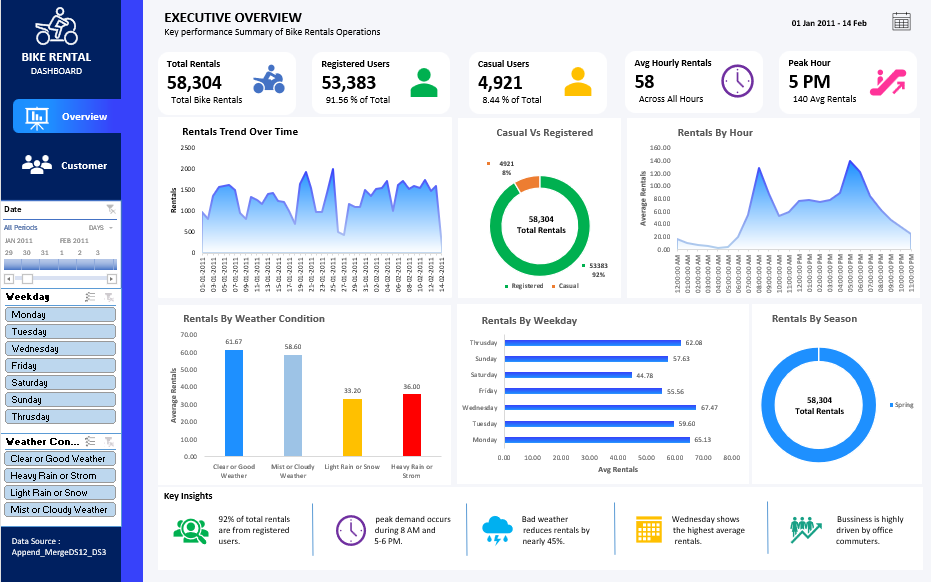
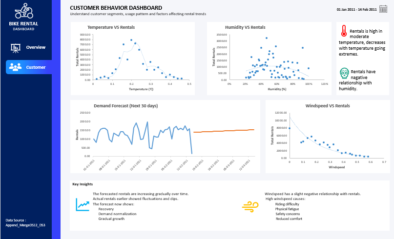

# 🚴 Bike Rental Demand Analysis & Forecasting Dashboard

Welcome to the **Bike Rental Analytics Project Repository**!  
This repository contains a complete Business Intelligence and Data Analytics project focused on analyzing bike rental demand, customer behavior, weather impact, and rental forecasting using interactive dashboards and visualization techniques.

The project demonstrates practical skills in:
- Data Cleaning & Transformation
- Exploratory Data Analysis (EDA)
- Dashboard Designing
- Business Intelligence
- Forecasting & Trend Analysis

---

# 📑 Table of Contents

- Project Overview
- Dashboard Preview
- Getting Started
- Project Features
- Tools & Technologies
- Key Insights
- Future Improvements
- Contact

---

# 📌 Project Overview

The **Bike Rental Demand Analysis & Forecasting Dashboard** helps analyze:
- Rental demand patterns
- Customer usage behavior
- Weather impact on rentals
- Peak business hours
- Seasonal demand trends
- Future rental forecasting

The dashboards are designed to provide meaningful business insights and support data-driven decision-making for bike-sharing businesses.

---

# 📊 Dashboard Preview

## 1️⃣ Executive Overview Dashboard

The Executive Dashboard provides a complete overview of business performance, rental statistics, and operational insights.

### Features:
- Total Rentals Analysis
- Casual vs Registered Users
- Rentals Trend Over Time
- Peak Hour Analysis
- Rentals by Weekday & Season
- Weather Impact Analysis
- Business Insights Summary



---

## 2️⃣ Customer Behavior & Forecasting Dashboard

This dashboard focuses on customer behavior analysis and future rental demand forecasting.

### Features:
- Temperature vs Rentals
- Humidity vs Rentals
- Windspeed vs Rentals
- Demand Forecasting (Next 30 Days)
- Customer Trend Analysis
- Environmental Impact on Rentals



---

# 🚀 Getting Started

Clone the repository

```bash
git clone https://github.com/your-username/bike-rental-dashboard.git
```

Go to the project directory

```bash
cd bike-rental-dashboard
```

Open the Excel / Power BI dashboard file to explore the project.

---

# 📂 Project Features

### ✅ Data Analysis
- Rental trend analysis
- Customer segmentation
- Weather dependency analysis
- Seasonal performance analysis

### ✅ Dashboard Design
- Interactive visuals
- KPI Cards
- Forecasting Charts
- Dynamic Filtering

### ✅ Forecasting
- Future rental demand prediction
- Trend identification
- Demand stabilization analysis

---

# 🛠️ Tools & Technologies Used

- Microsoft Excel
- Pivot Tables
- Pivot Charts
- Data Visualization
- Forecasting Techniques
- Dashboard Designing

---

# 📈 Key Insights

- Registered users contribute the majority of total rentals.
- Peak rental demand occurs during commuting hours.
- Moderate temperatures positively affect rentals.
- High humidity and strong windspeed reduce rental activity.
- Weather conditions significantly influence bike rental demand.
- Forecasted rentals show gradual growth and stabilization.

---

# 🎯 Business Objectives

This project aims to help businesses:
- Improve operational efficiency
- Optimize bike allocation
- Understand customer demand
- Enhance customer experience
- Support strategic decision-making

---

# 🚀 Future Improvements

- Machine Learning-Based Prediction Models
- Real-Time Data Integration
- Revenue Forecasting
- Geo-location Analysis
- Mobile Dashboard Optimization

---

# 👨‍💻 Author

**SAAYAN SAMANTA**  
Data Analytics & Business Intelligence Enthusiast

📧 Email: saayansamanta2003@gmail.com  
🐙 GitHub: SAAYAN-SAMANTA

---

# ⭐ Thank You

Thank you for visiting the Bike Rental Analytics Project Repository!  
If you found this project useful, feel free to ⭐ the repository and share your feedback.
